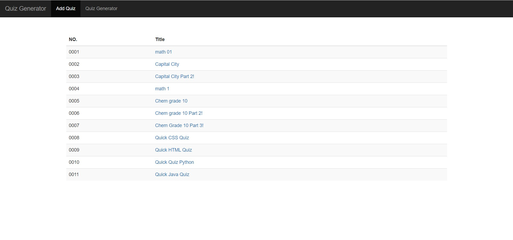
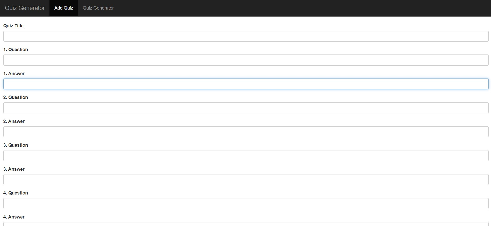
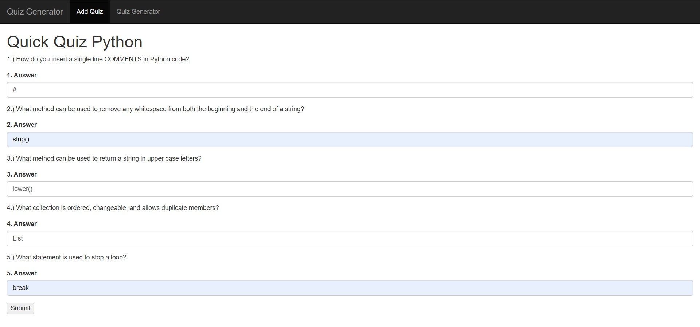
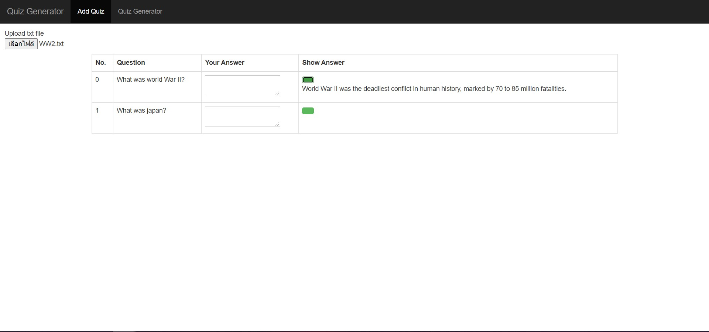

# Vikehacks-2020 - Quiz-Generator-App
Quiz Generator app is a study tool application that allows users to create, attempt and share quizzes with others as well as auto-generates a quiz from a text file. It means to help students prepare for their tests.  

The topic in this competition was to build a piece of software that enriched UVic students' lives. This topic inspires our team to build a tool that prepares UVic students for their tests. 

Check out this link: [https://quiz-generator-app.herokuapp.com/homepage.html](https://quiz-generator-app.herokuapp.com/homepage.html)

## How does Quiz Generator App work?

### Manual Mode
1. Ask users to create their quiz on the Add Quiz page
2. Store input data in JSON arrays
2. Generate a unique ID for the quiz created by users
3. Pull an ID and a quiz title from JSON arrays to create and display a quiz link on the Home page     
4. Allow other users to view and attempt the quizzes that display on the Home page
5. Pull ID and other data according to the quiz link selected by users
6. Create a Quiz Game page from the data pulled from JSON arrays
7. Allow users to attempt the quiz, check their answer and return the correct answers

### Auto-Generator Mode
1. Ask users to input text file
2. Scan the text file
3. Use Regex to separate each sentence by conjunction
4. Remove conjunctions and extra white spaces from the sentence
5. Remove all sentences that may not be able to become a question
6. Select a proper WH-question for the sentence that may be able to become a question
7. Add a WH-question and "?" to and reconstruct the sentence to make a question
8. Display a question and its original text on the Auto-Generator page     

## Key skills
* JavaScript
* PHP
* HTML/CSS/Boostrap/React
* JSon array
* I/O
* Regex library
* JS promise

## What is next for Quiz Generator App?
This 1st version of the Quiz Generator app was built within 24 hours of Hackathon time. Many features that can be improved.
1. Allow a quiz creator to set a public/private mode and a password to access his quiz
2. Show the number of views on every quiz
3. Use react to build a form to customize the number of questions
4. Add a search bar to search for specific quizzes
5. Improve error check
6. Improve the auto-generator mode
7. Add session

## Example of Home, AddQuiz, SampleQuiz, Answer and Auto-Generator

### Home Page

### Add Quiz Page

### Sample Quiz Page

### Answer Page

### Auto-Generator Page

